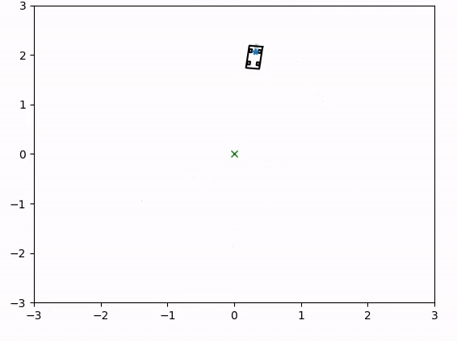
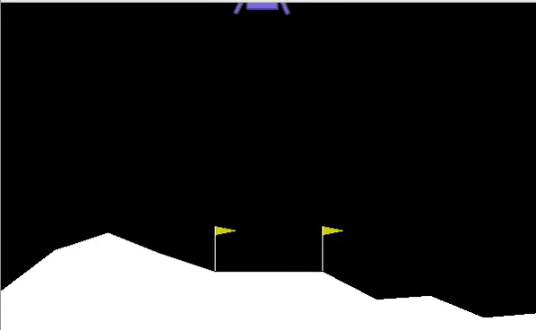

# Reinforcement-Learning-with-CLF-s
[](https://opensource.org/licenses/MIT)

This project contains code for some RL implementations where a Control Lyapunov Function is added to the reward function to accelerate the training process. This project also contains MATLAB code for computing Control Lyapunov Functions using Hamilton-Jacobi Reachability analysis. Read the full paper here. 


Here, we show the trajectories of the different RL implementations done with our method. 

<table>
  <tr>
    <td style="height: 10px;">1. Dubins Car Trajectory </td>
    <td style="height: 10px;">2. Lunar Lander</td>
  </tr>
  <tr>
    <td valign="top"></td>
    <td valign="top"></td>
  </tr>
 </table>

<table>
  <tr>
   <td style="height: 10px;">3. Drone Landing (Left):xz plane (Right): y</td>  
  </tr>
  <tr>
    <td valign="top"></td>
  </tr>
 </table>
 


## Paper Abstract

Recent methods using Reinforcement Learning (RL) have proven to be successful for training intelligent agents in unknown environments. However, RL has not been applied widely in real-world robotics scenarios. This is because current state-of-the-art RL methods require large amounts of data to learn a specific task, leading to unreasonable costs when deploying the agent to collect data in real-world applications. In this paper, we build from existing work that reshapes the reward function in RL by introducing a Control Lyapunov Function (CLF), which is demonstrated to reduce the sample complexity. Still, this formulation requires knowing a CLF of the system, 
but due to the lack of a general method, it is often a challenge to identify a suitable CLF. To this end, we propose using an existing method that computes low-dimensional CLFs via Hamilton-Jacobi reachability procedure. Such a method becomes intractable on high-dimensional systems, a problem that we address by using a novel system decomposition technique to compute what we call Decomposed Control Lyapunov Functions (DCLFs). We use the computed DCLF for reward shaping, which we show improves RL performance. Through multiple examples, we demonstrate the effectiveness of this approach, where our method finds a policy to successfully land a quadcopter in $600$ episodes equivalent to approximately $1800$ seconds of real-world data, compared to RL baselines, where it takes $2 \times 10^3$ episodes to first land the vehicle.
\end{abstract}


## Dependencies 
- gym - 0.18.0 
- numpy - 1.19.5 
- matplotlib - 3.3.4 
- pytorch - 1.8.1 

## Implementation 

### Constructing CLF

- `src/Reachability_CLVF` contains the code in MATLAB necessary for computing Lyapunov functions using Reachability. 
- ToolboxLS contains the code for using Level Set methods to obtain solutions for Hamilton-Jacobi partial differential equations. For more information on how to use this toolbox, see [here](https://www.cs.ubc.ca/~mitchell/ToolboxLS/)
- Before using the ToolBox, go to `src/Reachability_CLVF/add_path_to_tollbox.m` and modify the respective path accordingly to your computer. The run the script. 
- helperOC-master has integrated functions to facilitate using the Toolbox. See [here]https://github.com/HJReachability/helperOC for more information on how to use helperOC. 
- SystemDecomposition contains different examples for using our method to compute DCLF using system decomposition. Run `/src/Reachability_CLVF/System Decomposition/Dubins Car CLVF/main_dubins.m` to visualize the CLF for a Dubins Car example. This also creates a variable V_1.mat, which is used for the next steps in RL training. 

### Reinforcement Learning 

- In `src/`, there are two folders for running our approach on a Dubins Car example and the Lunar Lander environment from OpenAI. Run `src/dubins_model_gymenv/dubins_CLF.py` to see a demo of the Dubins Car trajectory after training. This demo trains the agent using the SAC algorithm with the DCLF learned from our method. 
- You can change the training by adding different CLFs obtained from MATLAB. Just add the respective file V_1.mat (which is the DCLF obtained using our method) to the folder `src/dubins_model_gymenv`


## Contact 
For any questions on using this code, do not hesitate to contact Antonio Lopez at [alopezz@utexas.edu](mailto:alopezz@utexas.edu) or open an issue.

## Cite this work

```
@article{DCLF,
  author  = "Lopez, Antonio and Fridovich-Keil, David",
  title   = "Decomposing Control Lyapunov Functions for Efficient Reinforcement Learning",
  journal = "IEEE Robotics and Automation Letters",
  year    = 2024,
  volume  = "",
  number  = "",
  pages   = ""
}
```


